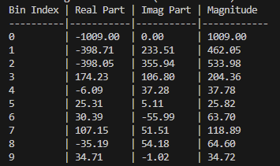

# 离线版本测试流程

## 1D FFT 

由上一步做完数据重排验证之后的数据，进行1D FFT离线版本的测试。

具体步骤如下：
1. **准备重排后的数据**：运行数据准备脚本，本测试数据见 `data/rff_input_buffer.txt`。
2. **将数据复制到测试代码中运行**：将数据复制到`Tests/C/test_1dfft.c`文件数组`TEST_INPUT_CHIRP[RADAR_CHIRP_POINTS]`中。
3. **运行python脚本生成参考结果**：运行`Tests/python/fft_result_verify.py`脚本,由于只是简单对照结果，所以不保存文件，只打印前几个结果进行对比。
4. **对比结果**：运行`test_1dfft`测试程序，查看输出结果与python脚本打印的结果进行对比。

