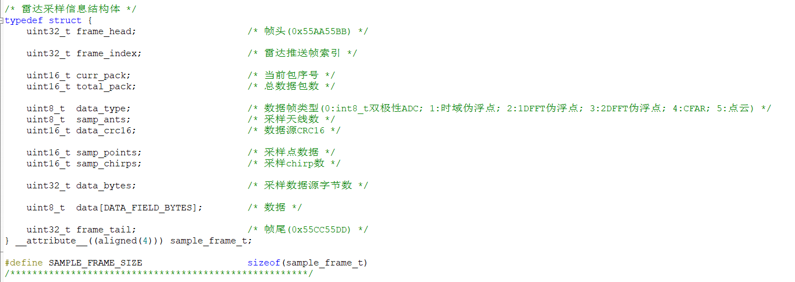
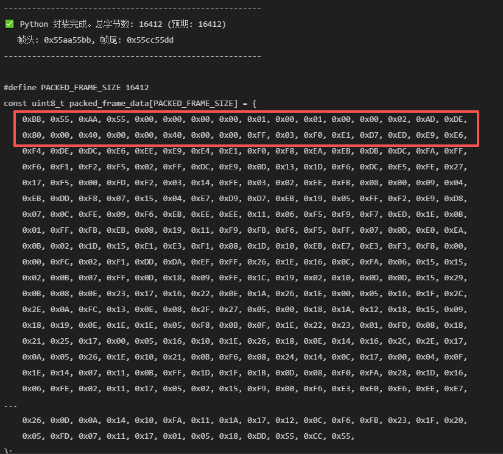
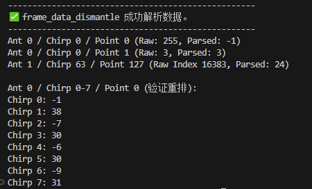

# 离线版本测试流程

## 离线数据封装

首先拿到雷达采集的原始数据，然后进行封装，生成符合协议的离线数据文件。 
本测试数据见 `data/TEST2.json`。

具体步骤如下：
1. **准备原始数据**：本测试数据见 `data/TEST2.json`。
2. **编写封装的脚本**：见 `data/analysis_date.py`，
将原始数据按照协议进行封装。脚本需要处理数据头、数据体和数据尾的格式。

3. **运行封装脚本**：执行脚本，生成封装后的离线数据保存在同名.txt中，

4. **验证封装结果**：

5. **数据去向**：将测试结果需要复制到`Tests/test_frame_data_dismantle.c`文件数组。

## 离线数据拆包测试

1. **编译测试代码**：确保 `CMakeLists.txt` 中包含了 `Tests/C` 目录，然后运行 CMake 和编译命令。
2. **运行测试程序**：执行生成的测试可执行文件 `test_frame_dismantle`。
3. **查看输出结果**：程序会输出拆包后的数据，验证其是否与预期一致同时会打印前几个在终端可以看一下。

