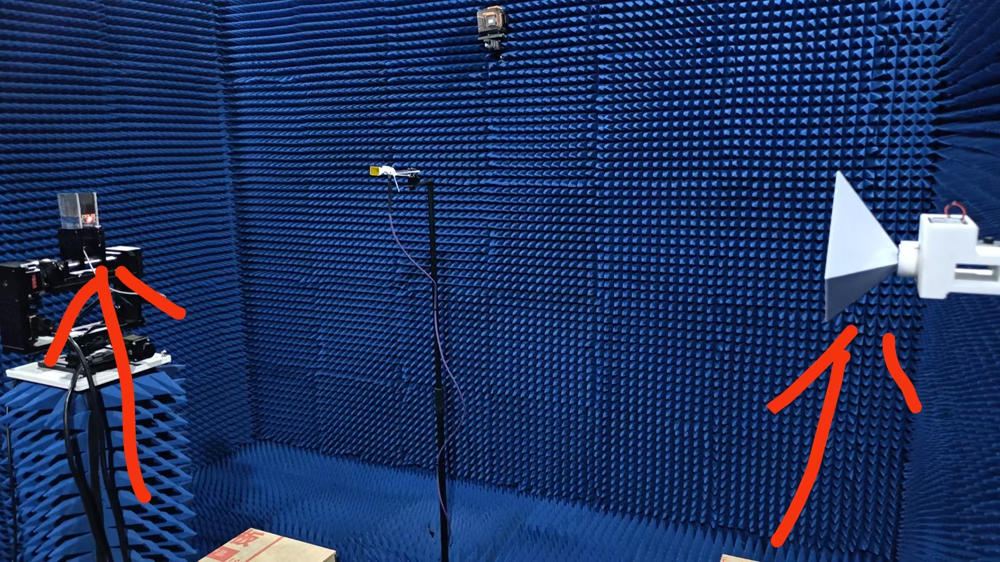
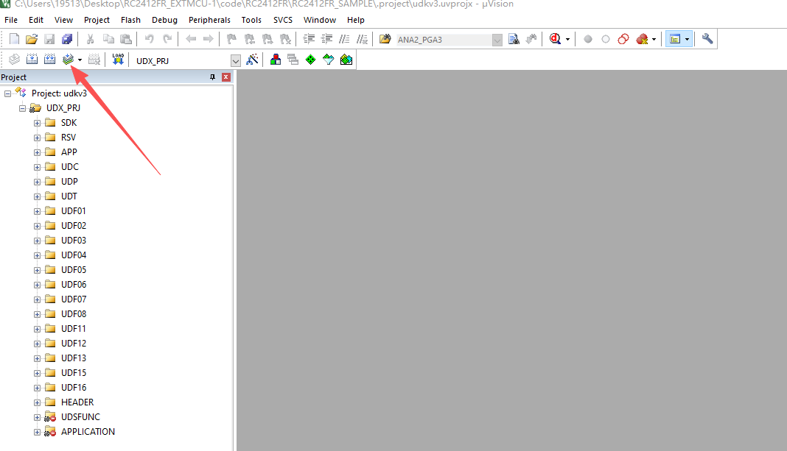
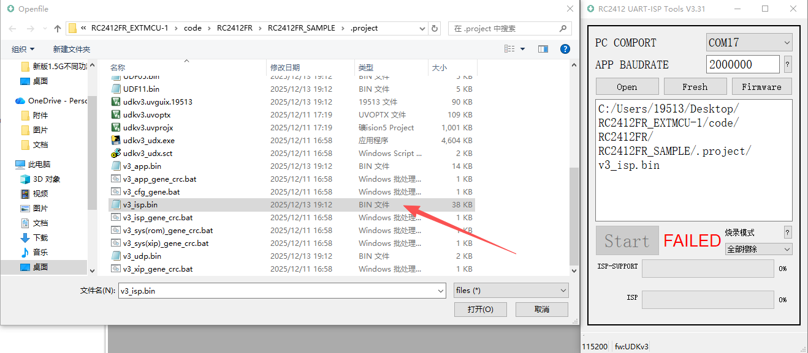
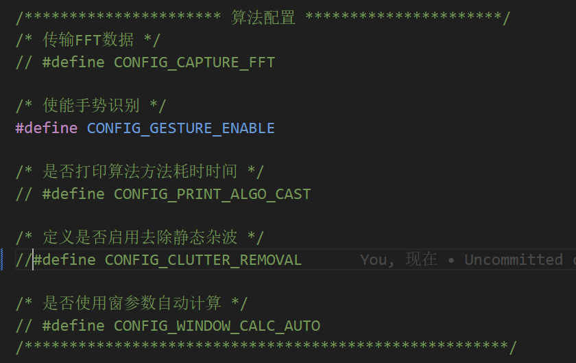
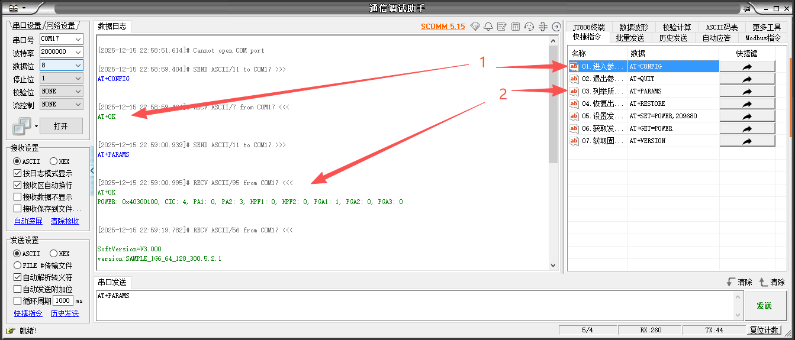
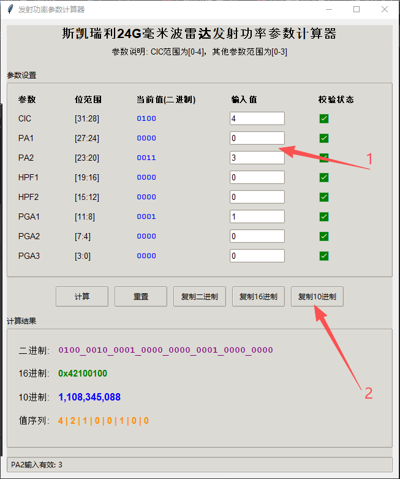
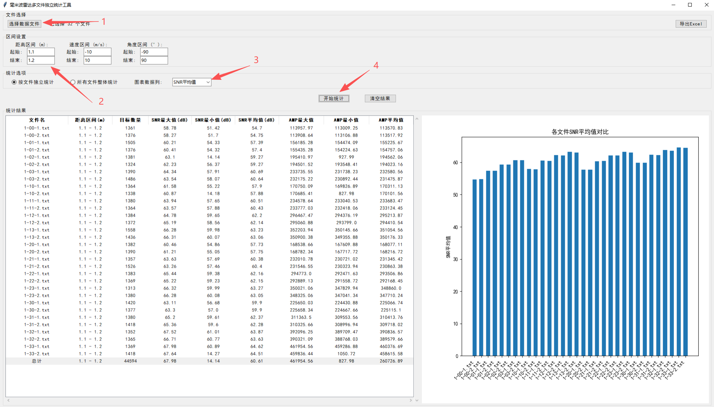
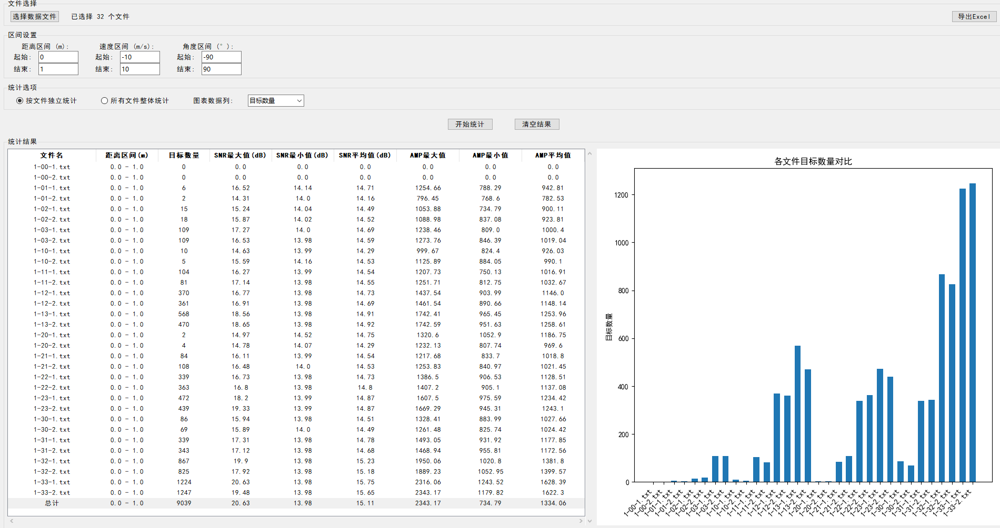
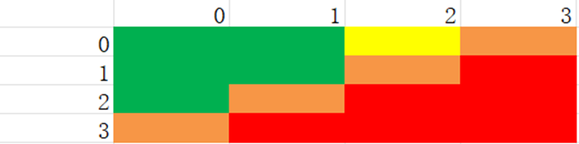

# 板子关于功率测量规范

## 1. 测试目的：
观察手势识别项目中，不同批次板子之间功率差异导致的挡位变化。

## 2. 测试环境/条件

### 1. 环境：6楼暗室
### 2. 模块安装位置，转动电机处


## 3. 测试产品

关于手势识别的不同批次板子

## 烧录代码流程

首先，需要确定波形，目前可调波形为
```c
/**
 * 00  --  1500M，128chirp，128点
 * 01  --  1500M，64 chirp，128点
 * 02  --  1600M，64 chirp，64 点
 * 03  --  1600M，64 chirp，128点
 */
#define RAMP_CFG_SETS       ()  //将此数值设定为波形前代表数值
```
设定完成之后编译

烧录


在暗室环境采数时，应将外挂MCU算法部分去除静态杂波部分功能关闭，以检测到静态目标，方便定量分析。


## 功率修改流程
首先打开项目工程中的通信调试助手，点击01。进入参数调节，之后03.列举当前功率参数

之后使用项目工程中的功率参数计算器计算出想要配置的挡位，复制10进制数值进05发射功率调节，注意以换行结尾


然后点击05设置之后，再次点击03查看是否修改成功，之后02退出参数。就可以进入采数阶段了

## 采数流程
当遍历16个挡位之后，接下来利用数据分析工具，来查找最好的挡位



当前图例中，静态角反的位置是在1.14m处，设定好区间，我们就可以看到，目标体在不同挡位下的信噪比，幅值，可以看出是递增的趋势，由于环境是在暗室，原则上我们应该只能得到目标点所在位置的点，此时将区间设置成0到1米，观察多出来的噪声点（可能是谐波或者其他噪点）的特性。



可以得到上图，观察发现，当功率偏低一点的时候，杂点目标数量较少，以横纵坐标分别表示两个发射功率的挡位做出是示意图，如下：



其中绿色表示杂点较少，是应该优先选用的挡位


